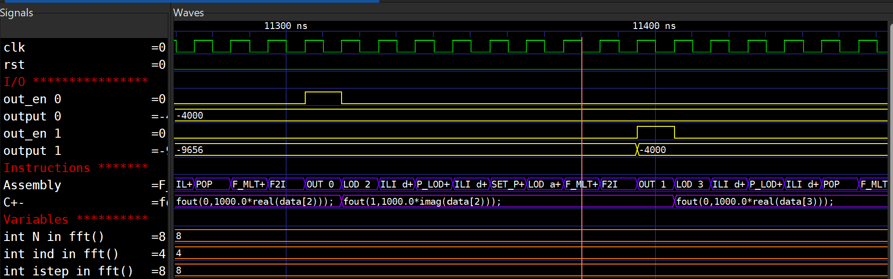

<p align="center">
  
</p>

<h1 align="center">YANC</h1>
<p align="center"><strong>Yet Another Compiler</strong> — toolchain for the SAPHO soft-processor ecosystem</p>

<p align="center">
  <a href="LICENSE"></a>
  <a href="https://github.com/nipscernlab/yanc/releases/latest"></a>
  <a href="https://github.com/nipscernlab/yanc/actions/workflows/release.yml"></a>
</p>

---

## What is YANC?

YANC is the compilation backbone of the [SAPHO](https://github.com/nipscernlab) soft-processor ecosystem. It takes a high-level program — written in either **CMM** (a small C-like language with first-class fixed-point, floating-point, complex and Dirac-notation operators) or in **C++** — and compiles it all the way down to a synthesizable SAPHO core, its program/data memory images, and a ready-to-run testbench.

YANC is used by the **Aurora** desktop app, but it can also be used standalone — just call the binaries from a shell script that walks through the pipeline.

## Pipeline

YANC has **three compilers** (`cmmcomp`, `cppcomp`, `asmcomp`). Two front-end compilers turn high-level source into assembly; a single back-end compiler turns that assembly into Verilog. Each compiler is preceded by an optional preprocessor (`cpppp` for C++, `appcomp` for assembly macros).

```
  CMM:    foo.cmm  ─────────────────────►  cmmcomp  ─┐
                                                     ▼
                                                  foo.asm  ──►  appcomp  ──►  asmcomp  ──►  foo.v + *.mif + foo_tb.v
                                                     ▲
  C++:    foo.cpp  ──►  cpppp  ──►  cppcomp  ────────┘
```

After `asmcomp`, the generated Verilog can be simulated with **Icarus Verilog** (`iverilog` + `vvp`) — or, for heavy testbenches, with **Verilator** — and visualized in **GTKWave**. The provided `go_proc.bat` / `go_proj.bat` wire up the iverilog flow end-to-end.

## What you see in GTKWave

Because the toolchain emits a side-table mapping each PC value to its
originating C+- source line, GTKWave shows the executing C+- line,
the assembly opcode, and every declared variable evolving in lockstep
with the simulated clock — not just raw bus toggles:



The example above is `proc_fft` mid-run: the C+- track shows the
`fout(0, 1000.0*real(data[2]));` statement, the assembly track shows
the matching `LOD / F_MLT+ / F2I / OUT 0` sequence, and the
declared variables (`N`, `ind`, `istep`, `j`, `k`, `m`, `mmax`,
`sind`, `comp temp`) carry their live values.

## Components

Six binaries are produced from source — three compilers, two preprocessors, and one helper:

**Compilers**

| Binary       | Source dir              | Built with         | Role                                                |
| ------------ | ----------------------- | ------------------ | --------------------------------------------------- |
| `cmmcomp`    | `Compilers/CMMComp/`    | Flex + Bison + GCC | CMM front-end → assembly                            |
| `cppcomp`    | `Compilers/CPPComp/`    | Flex + Bison + GCC | C++ front-end → assembly                            |
| `asmcomp`    | `Compilers/ASMComp/`    | Flex + GCC         | Back-end: assembly → Verilog HDL + memory images + testbench |

**Preprocessors**

| Binary       | Source dir              | Built with    | Role                                                                |
| ------------ | ----------------------- | ------------- | ------------------------------------------------------------------- |
| `cpppp`      | `Compilers/CPPComp/`    | GCC           | C++ preprocessor for `cppcomp` (`#include`, `#define`, `#if`, ...)  |
| `appcomp`    | `Compilers/APPComp/`    | Flex + GCC    | First pass over the `.asm`: records processor params + resolves variable/label addresses for `asmcomp` |

**Helper**

| Binary       | Source dir   | Built with    | Role                                                |
| ------------ | ------------ | ------------- | --------------------------------------------------- |
| `comp2gtkw`  | `Scripts/`   | GCC           | Translator: complex-number bit pattern → GTKWave    |

Auxiliary content:

* `HDL/` — reusable Verilog modules (processor core, ALU, instruction decoder, FIFO, ...)
* `Compilers/CMMComp/Includes/` — assembly macros and lookup tables for `.cmm` programs (`float_sqrt`, `float_sin`, `float_atan`, ...)
* `Compilers/CPPComp/Includes/` — header shims that `.cpp` programs include
* `Scripts/` — `regress.sh`, `comp2gtkw`, Tcl scripts that set up the GTKWave view
* `Compilers/CMMComp/Tests/` — runnable `.cmm` example projects (Math, FFT, RLS, DTW, PulseSim, Blind, ...)
* `Compilers/CPPComp/Tests/` — per-test C++ programs (`test1` … `test51`), plus the Verilator harness
* `Compilers/yanc_version.h` — single source of truth for the toolchain version, included by all five binaries (the three compilers + the two preprocessors)

## Quick start

### 1. Get the binaries

**Option A — pre-built (fastest).** Download the latest release zip from [Releases](https://github.com/nipscernlab/yanc/releases/latest) and extract it. The zip contains `bin/` (the six executables), `HDL/`, `Macros/` (CMM-side includes), and `Header/` (C++-side includes).

**Option B — build from source.**

Requirements (Windows + [MSYS2](https://www.msys2.org/)):

* The MinGW-w64 cross toolchain — install with `pacman -S mingw-w64-x86_64-gcc`. The build calls `x86_64-w64-mingw32-gcc.exe` (the cross tuple, not plain `gcc.exe`) on purpose: it produces stand-alone Windows `.exe`s with no MSYS2 DLL runtime dependency, so the deployed binaries work on any Windows machine.
* `bison` and `flex` — install with `pacman -S bison flex`.
* These three tools must be reachable on your `PATH`. The script bails early with the exact line to add if any of them is missing. Typical setup:
  ```
  set PATH=C:\msys64\mingw64\bin;C:\msys64\usr\bin;%PATH%
  ```
* Optional, only needed if you want to simulate generated Verilog: [Icarus Verilog](http://iverilog.icarus.com/) and/or [Verilator](https://verilator.org/), plus [GTKWave](https://gtkwave.sourceforge.net/) for waveform viewing.

`Scripts/aurora.bat` builds all six binaries and deploys them into a sibling `Aurora/components/` checkout. It assumes the two repos sit side by side under a common parent — no absolute paths, no editing required:

```
<parent>\
   yanc\        (this repo)
   Aurora\
      components\   <-- deploy target
```

Run it from anywhere (it derives both paths from `%~dp0`):

```bat
Scripts\aurora.bat
```

A polished `make`-style entry-point is on the to-do list; for now this batch script is the supported path on Windows. If you only need the binaries, the relevant `gcc` invocations are visible inside `Scripts/aurora.bat` — each compiler is a single `bison`/`flex` + `gcc` line.

### 2. Run the pipeline standalone

The full flow is at most six self-contained CLI steps: alternating preprocess/compile passes that take the source down to Verilog, then the simulation and viewing. Here is a minimal end-to-end script that turns a C++ source file into a Verilog testbench and runs it under Icarus Verilog — no Aurora, no `go_proc.bat` needed:

```bat
:: --- toolchain -----------------------------------------------------------
set BIN=C:\path\to\yanc\bin
set HDL=C:\path\to\yanc\HDL
set MAC=C:\path\to\yanc\Macros
set HDR=C:\path\to\yanc\Header

:: --- user input ----------------------------------------------------------
set SRC=my_program.cpp
set NAME=my_proc
set PROJ=%CD%\out\%NAME%
set TMP=%CD%\tmp
mkdir %PROJ%\Software %PROJ%\Hardware %PROJ%\Simulation %TMP%

:: --- 1. preprocess C++ source (skip this for .cmm sources) ---------------
%BIN%\cpppp.exe   -i %SRC% -o %TMP%\pp.cpp -I %HDR%

:: --- 2. compile source -> assembly ---------------------------------------
%BIN%\cppcomp.exe -i %TMP%\pp.cpp -n %NAME% -p %PROJ% -t %TMP%
:: ...or, for a .cmm source instead (no separate preprocess step needed):
:: %BIN%\cmmcomp.exe -i %SRC% -n %NAME% -p %PROJ% -m %MAC% -t %TMP%

:: --- 3. resolve addresses + processor params -> log read by asmcomp ------
%BIN%\appcomp.exe -i %PROJ%\Software\%NAME%.asm -t %TMP%

:: --- 4. compile assembly -> Verilog HDL + memory images + testbench ------
%BIN%\asmcomp.exe -i %PROJ%\Software\%NAME%.asm -p %PROJ% ^
                  -d %HDL% -m %MAC% -t %TMP% -f 100 -c 1000000

:: --- 5. simulate (Icarus) ------------------------------------------------
iverilog -s %NAME%_tb -o %TMP%\%NAME%.vvp ^
         %HDL%\*.v %PROJ%\Hardware\%NAME%.v %PROJ%\Simulation\%NAME%_tb.v
vvp %TMP%\%NAME%.vvp -fst

:: --- 6. view waveform ----------------------------------------------------
gtkwave %TMP%\%NAME%_tb.fst
```

You can stop at step 4 if all you want are the Verilog/memory artifacts (e.g. to feed your own simulator), or replace step 5 with **Verilator** for heavy testbenches — see `CPPComp/Tests/Verilator/` for a working harness.

For convenience, two pre-wired Windows scripts are provided that bundle steps 1–6 with sensible defaults:

```bat
go_proc.bat       :: single-processor example (edit PROJET / PROC / FNAM at the top)
go_proj.bat       :: multi-processor project example
```

## CLI flags

All five binaries accept **named options** with short and long forms.
Run any of them with `-h` / `--help` for the per-tool synopsis, or
`-V` / `--version` for the version string.

`cmmcomp`, `appcomp` and `asmcomp` produce bilingual diagnostic messages:

```
-pt    Portuguese (default)
-en    English
```

Each tool's required options:

```bat
:: compilers
cmmcomp -i <file.cmm> -n <name> -p <proc-dir> -m <macros-dir> -t <temp-dir> [-A]
cppcomp -i <file.cpp> -n <name> -p <proc-dir> -t <temp-dir>
asmcomp -i <file.asm> -p <proc-dir> -d <hdl-dir> -m <macros-dir> -t <temp-dir> [-f <MHz>] [-c <clocks>]

:: preprocessors
cpppp   -i <file.cpp> -o <file.cpp> [-I <dir>]...
appcomp -i <file.asm> -t <temp-dir>
```

`-A` / `--array` (cmmcomp only) tells the toolchain to emit per-element waveform signals for declared arrays — useful when visualizing buffer contents in GTKWave.

Every short option has a long form (`--input`, `--proc-dir`, `--temp-dir`, `--macros-dir`, `--hdl-dir`, `--freq`, `--clocks`, `--name`, `--array`, …).

Example:

```bat
cmmcomp -en -i my_program.cmm -n proc_fft -p C:\proj\proc_fft -m C:\Macros -t C:\Temp\proc_fft
```

## Example CMM

```c
#PRNAME Sqrt
#NUBITS 32
#NBMANT 23
#NBEXPO 8
#NUIOIN 1
#NUIOOU 1

float my_sqrt(float num)
{
    if (num == 0.0) return 0.0;

    int v = (((num << 1) >>> 24) + 22) >>> 1;         // get the exponent
        v = ((((v-22) << 23) + (1 << 22)) << 1) >> 1; // build the float

    float x; copy(v,x);

    x = 0.5 * (x + num/x);   // 4 Newton-Raphson iterations
    x = 0.5 * (x + num/x);
    x = 0.5 * (x + num/x);
    x = 0.5 * (x + num/x);

    return x;
}

void main()
{
    float x[1000] "sqrt_x.txt";
    float a[1000] "sqrt_y.txt";
    float y, t, e;
    int   j = 0;
    while (j < 1000)
    {
        y = sqrt(x[j]);     // built-in (uses macro from CMMComp/Includes/float_sqrt.asm)
        t = a[j];
        e = t - y;
        j++;
    }
}
```

More examples in `CMMComp/Tests/` and `CPPComp/Tests/`.

## Project layout

```
yanc/
├── Compilers/
│   ├── APPComp/          appcomp sources (Headers/ + Sources/)
│   ├── ASMComp/          asmcomp sources (Headers/ + Sources/)
│   ├── CMMComp/          cmmcomp sources + Includes/ (macros) + Tests/ (per-proc projects)
│   ├── CPPComp/          cpppp + cppcomp sources + Includes/ (C++ shims) + Tests/ (per-test programs + Verilator/)
│   └── yanc_version.h    single-source-of-truth toolchain version
├── HDL/                  reusable Verilog modules (core, ALU, decoders, FIFO, ...)
├── Scripts/              aurora.bat (build + deploy), regress.sh, comp2gtkw, Tcl viewers
├── docs/images/          README assets (GTKWave screenshot, ...)
├── go_proc.bat           single-processor end-to-end pipeline
├── go_proj.bat           multi-processor project pipeline
└── .github/workflows/    CI (release on tag push)
```

## Contributing

Issues and pull requests are welcome. See [CONTRIBUTING.md](CONTRIBUTING.md)
for the conventions on commits, comments, and the bilingual `MSG_*`
diagnostic pattern.

## License

MIT — see [LICENSE](LICENSE).
